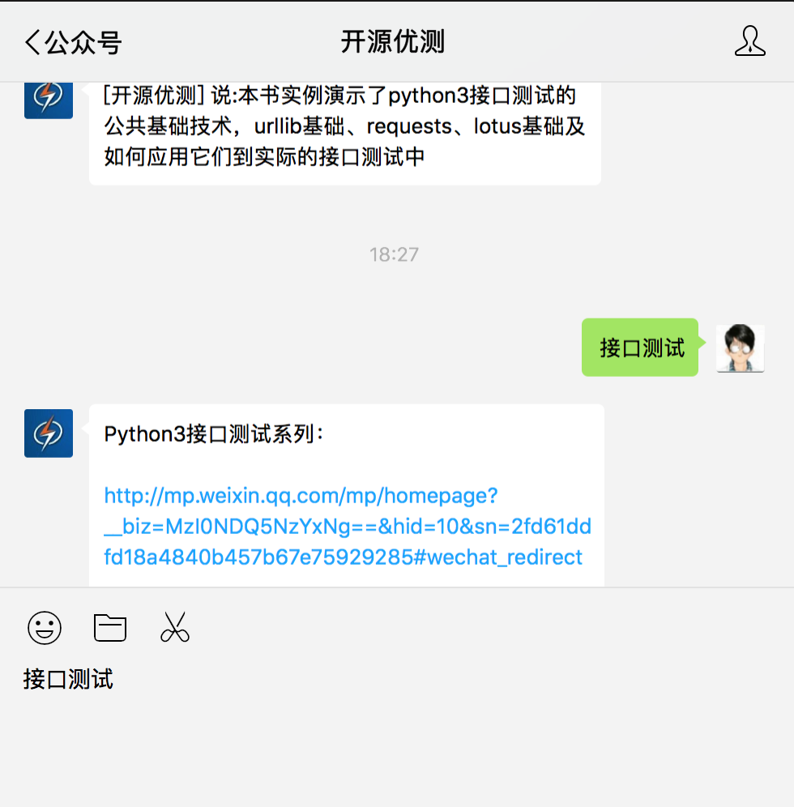
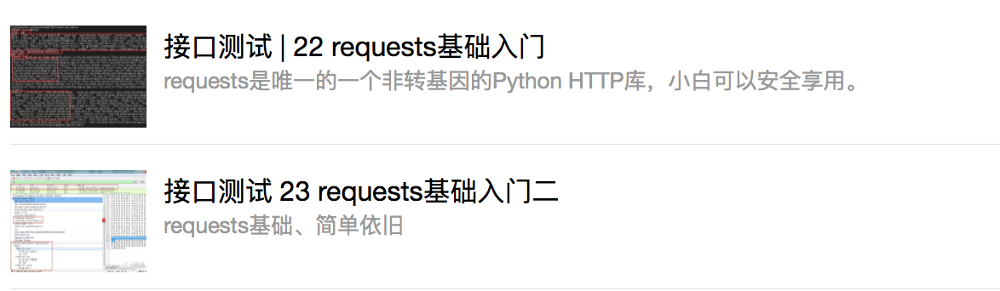

## 获取任务

在公众号里回复：接口测试

获取接口测试系列文章，如下图：

## 任务

完成以下文章练习

## 扩展

请在一个礼拜内完成http://docs.python-requests.org/zh_CN/latest/

requests官方文章的学习

1. 了解requests是什么

2. 掌握requests的基本工具，例如如何get、post，如何读取不同响应格式的response

3. 形成2-5篇学习记录
