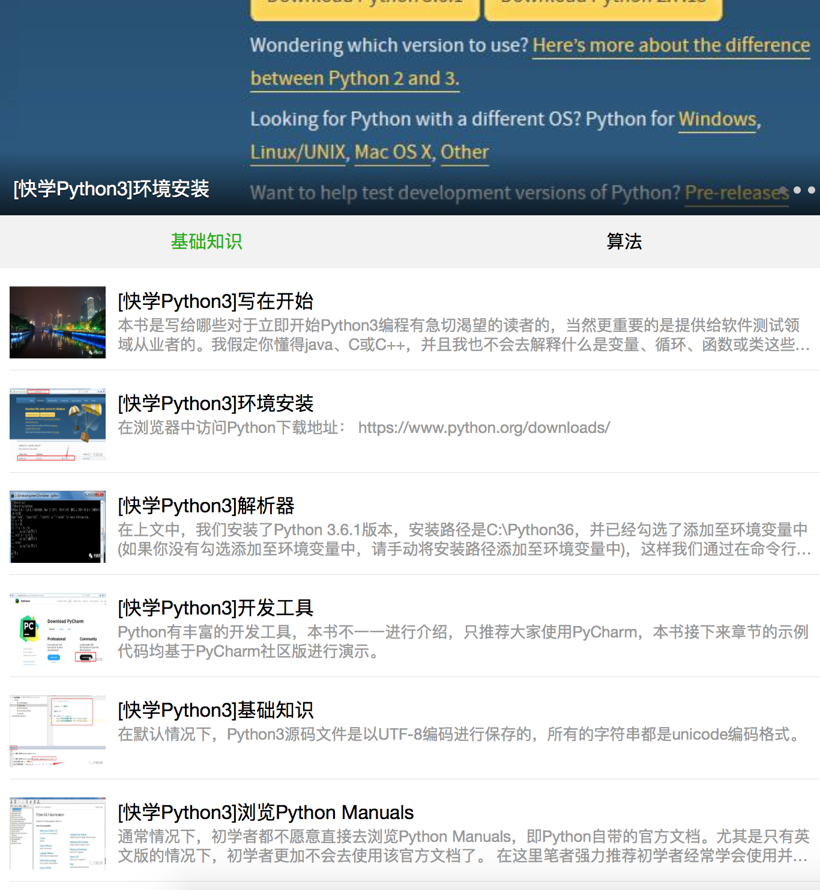

## 概述

从第一次任务的情况来看，存在以下两大主要问题：

1. 大家的编程底子非常的弱，编程经验可以视为0

2. 习惯性的伸手问过程、细节，缺乏知识梳理能力

## 怎么改进

为了更好的改进上述问题，接下主要任务将以以下几个方面为主：

1. 大量的练习基础语法代码，以便熟悉Python语言

2. 大量的使用Python标准库，以掌握各种标准库的能力

看Python3官方手册标准库目录，反复看，一直看，直到你呕吐还得继续看，不要停

3. 大量的练习基础算法能力，以增强编程功底

4. 快速大量的阅读，涉及技术、人文、基础理念等等

## 主要任务

1. 快速、多次的阅读《Python简明教程》，要求做到只看书的目录即可基本回忆起总体内容

2. 深入阅读自己所购买的Python书籍，唯一的要求就是**快速反复**的阅读

3. 请把公众号中《快学Python3》的所有的示例全部练习一遍，约有70个示例（要求在**2个礼拜内**练习完毕）

在公众号里回复： Python3  即可获取对应的系列教程，如下图

4. 请大家去阅读 大前研一 的一本书 《专业主义》，这是一本非技术类的书，非常系统的描述了如何在成为一名专家

## 要求

1. 每日将完成的代码提交至github上，每天必须**200行以上**的代码练习

2. 对于所要求的书籍，务必**快速反复**的阅读，不求看懂，只求看过，通过快速的大量的信息来**冲刷**大脑

3. 每天要记录学习总结，强迫自己来形成记录的习惯

4. 如可能，请在工作中或身边找一名可以共同学习，成长的朋友一起学习，相互监督（这是线下的，最好是你的同事或朋友，不是让你找网友^_^）

扫一扫关注公众号 开源优测

