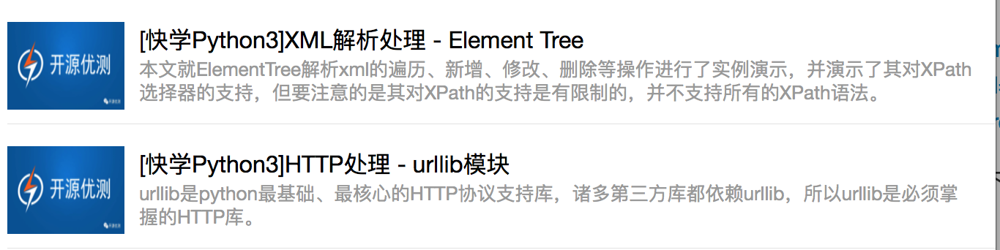

## 概述

不少人的进度很快，但大部分人的进度还是相对较慢，可能是工作忙，但我想更多还是自己给的压力不够。

把第二次任务进行一下拆分，以便大家进一步增强基础练习

## 快学Python3系列示例练习

系列文章：快学Python3系列：

http://mp.weixin.qq.com/mp/homepage?__biz=MzI0NDQ5NzYxNg==&hid=8&sn=ceba61cd11a58fef9a523733f327b40f#wechat_redirect

将本系列代码示例练习，拆为8天，如下：

第一天

第二天

第三天

第四天

第五天

第六天

第七天

第八天

## 扩展任务

对于已经把快学Python3系列基础示例练习完了的，可以考虑综合利用上述基础知识完成以下任务：

实现一个基本的爬虫，从利用豆瓣API爬取python相关数据信息，包括但不限于：书名、作者、定价、摘要等等，并将这些信息格式化到excel文档中

